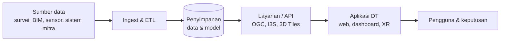

# Arsitektur

## Diagram

## Komponen
| Lapisan | Teknologi/platform | Catatan |
|---|---|---|
| Akuisisi | | |
| Ingest & ETL | | |
| Penyimpanan | | |
| Layanan/API | | |
| Aplikasi | | |
| Analitik/AI | | |

## Standar data
- CRS:
- Format 3D:
- Skema ID aset:
- Frekuensi pembaruan:

## Keputusan arsitektur
| # | Keputusan | Alasan | Tanggal |
|---|---|---|---|
| 1 | | | |
